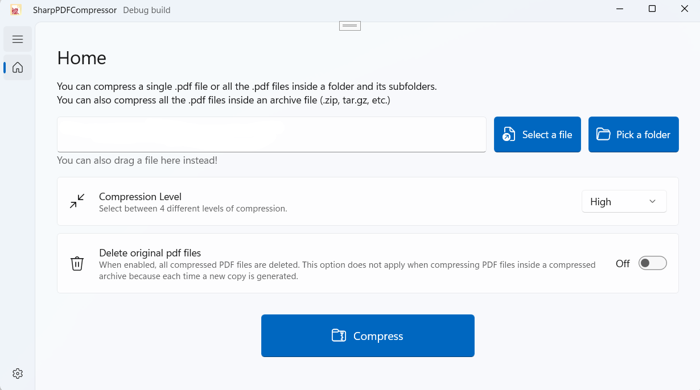

#    SharpPDFCompressor

A free and open source (FOSS) native WinUI3 application that compresses pdf files. Based on [ghostscript](https://ghostscript.com/) as the underlying compression engine.

## How it works

You can select either a single file or a folder. When selecting a folder, the program searches all pdf files inside the folder and all the sub-folders and compresses them.

Unless you enable the `Delete original pdf files` slider, the pdf files compressed will be duplicated with an added prefix of `_compressed.pdf`.

You can also pick an archive `(.zip, .tar.gz, .rar etc)`. In this case a new copy of the.zip file is created only keeping the compressed pdf files.

In any case when compressing a folder or an archive other file types are not affected.

## Contributions

Contributions are very welcome. This is my first WinUI app and I am still making myself familiar to C# and .NET world, so if you have any suggestions make sure to create a PR.

I hope you find this application of use. 

## Microsoft Store

The application is available for free to download and use from the Microsoft Store.

